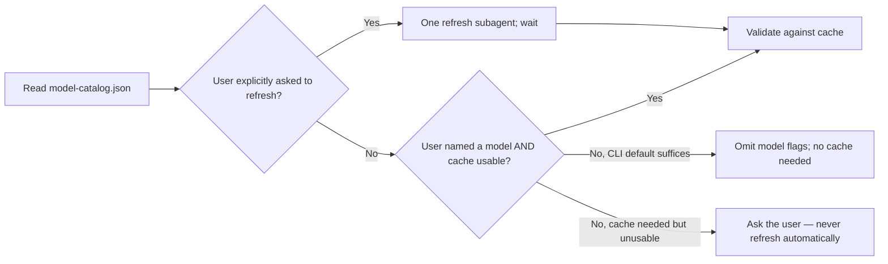
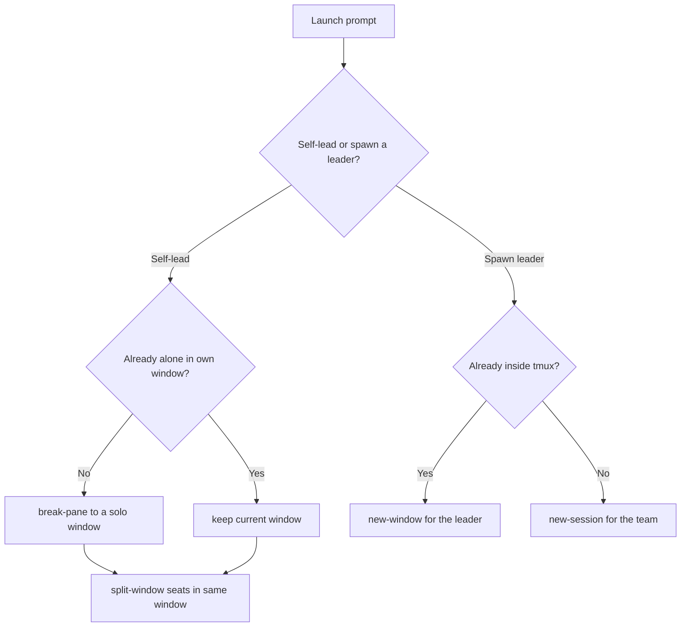

# tmux Agent Teams

## Overview

Drive several agent CLIs, each in its own tmux pane, as one team: you (the current agent) are the lead and orchestrator — dispatch subtasks, schedule, collect, synthesize, and continuously supervise and report status to the user. The lead never takes a work seat; it only orchestrates.

**Core principle: keys down, files back.** Dispatch with `send-keys -l`; results come back as mailbox files the agent writes. Never scrape answers off the screen — TUI agents run on the alternate screen (`capture-pane -S` has NO scrollback there) and verbose logs scroll answers away. `capture-pane` is for liveness checks and debugging only.

## When to Use

- Heterogeneous or external agent CLIs must cooperate — the built-in Agent/Workflow tools can't drive external CLIs
- User asks to coordinate agents already running in tmux panes

**Not for:** same-harness subagents as work seats (use Agent tool / Workflow —
cheaper and structured); a single quick question to one pane. The bounded model
cache refresh helper below is the only same-harness exception, and it runs only
when the user explicitly asks to refresh.

## Team Design & Confirmation (MANDATORY first step)

The roster is fixed to two CLIs — never use others. If a `model-catalog.json`
exists next to this file, read it before designing the roster; this package
ships without one — configure it on the target server, or run an explicit
refresh, before relying on cached model validation. Normal team startup must
not query live model catalogs. After the user confirms the roster, launch in
full-access mode by default:

| CLI    | Full-access launch (default)                               | Session-scoped model override |
| ------ | ---------------------------------------------------------- | ----------------------------- |
| claude | `command claude --dangerously-skip-permissions`            | `--model <m> --effort <e>`    |
| codex  | `command codex --dangerously-bypass-approvals-and-sandbox` | `-m <m> -c '<effort config>'` |

Before creating any session, launching any CLI, or dispatching anything:

1. **Load the model cache** (if present) and follow the cache decision flow
   below. Never refresh automatically — on any cache problem, ask the user. A
   refresh runs only when the user explicitly requests it, in exactly one
   same-harness subagent (never the lead, never a tmux team seat).
2. **Design the team**: seats, role per seat, CLI + model per seat,
   orchestration pattern. If the user did not specify a model, use `CLI default`
   (omit all model and effort flags).
3. **Present the design to the user and get confirmation** of the roster. A
   default model is confirmed as part of this single design review; do not ask a
   separate model question merely because the user omitted it.
4. Only then execute.

No exceptions:

- "It's a fresh dedicated session, not their panes" — still confirm. Pane-target confirmation (Protocol step 1) is a separate, additional check.
- "The flags/tools match what the user usually uses" — the roster still needs
  sign-off; `CLI default` is a valid model choice.
- "The task is read-only / low risk" — still confirm.

A subagent that cannot reach the user must return the team design as its final message and stop — do not launch anything.

## Cached Model Selection

Model catalogs and defaults can vary by CLI version, account, provider, and
workspace. `model-catalog.json` (sibling of this file) is the last-known-good
catalog. Use it as-is regardless of age — the cache is refreshed **only on
explicit user request**, never automatically on staleness, TTL, startup, a
missing entry, or a model miss. Do not call any CLI, including `--version`,
merely because this skill was loaded or a new team is being created.



| CLI    | Team default when unspecified                | One-session launch override                        |
| ------ | -------------------------------------------- | -------------------------------------------------- |
| claude | CLI default; omit `--model` and effort flags | `--model <model> --effort <level>`                 |
| codex  | CLI default; omit `-m` and effort config     | `-m <model> -c 'model_reasoning_effort="<level>"'` |

Apply this decision flow:

1. If the user explicitly asked to refresh, start one refresh subagent, wait for
   it, then use the updated cache.
2. If the user did not name a model, use the CLI default: omit all model and
   effort flags. No cache lookup is required for this path — a missing
   `model-catalog.json` does not block a CLI-default launch.
3. If the user explicitly named a model, validate it against the cache. If the
   cache is missing, invalid, has no usable entry, or misses that model, **ask
   the user** (offer to refresh); do not refresh silently. Absence from
   Claude's `partial` catalog is unknown, not proof that the model is
   unavailable.
4. Use the cache regardless of its age; show its `refreshed_at` date in the
   roster so the user can decide whether to request a refresh.
5. For an existing pane, preserve its active model. Do not silently restart or
   switch it.

## Model Cache Refresh — One Subagent Only

Refresh **only when the user explicitly requests it** — never automatically on
staleness, TTL, startup, a missing/invalid cache, or an unresolved model. In
those non-explicit cases, ask the user instead. Reuse one in-flight refresh
worker; never fan this task out by CLI. The worker is an orchestration helper,
not a roster seat, so it does not need team confirmation.

Give that subagent this contract:

1. Read this skill and the current `model-catalog.json` completely (create it
   if absent).
2. From the outer shell, run only the read-only discovery commands below. Run
   version commands only inside this refresh task.

   | CLI    | Version and discovery commands                                                         |
   | ------ | -------------------------------------------------------------------------------------- |
   | claude | `command claude --version`; `command claude --help`                                    |
   | codex  | `command codex --version`; `command codex debug models`; `command codex doctor --json` |

3. Filter command output inside the subagent. Store only model identifiers or
   labels, the effective default when discoverable, CLI version, source
   commands, status, and concise notes. Never return or place Codex's raw model
   instructions in the lead context or cache.
4. Do not launch an interactive agent, use `/model`, inspect or edit CLI config,
   or change any active pane. Claude's non-interactive catalog may remain
   `partial`.
5. Preserve the last-known-good entry when one CLI check fails and record a
   concise `last_error`. Set `refresh_after` to seven days after a fully
   successful refresh, or one day after a partial failure.
6. Write a sibling temporary JSON file, validate it with `jq -e .`, then
   atomically replace `model-catalog.json`. Never leave partially written JSON.
7. Return only a short change summary. The lead reads the cache, not raw command
   output.

If no same-harness subagent is available, keep using a usable stale cache and
disclose its date. If the cache is unusable, ask the user instead of moving the
slow discovery work back into the lead's startup path.

Never edit `~/.claude` or `~/.codex` configuration files as part of model
selection or testing. Prefer launch flags because their scope is explicit and
isolated to the new session. In the tested CLIs, Codex `/model` changed
persistent user settings; therefore automation must not use `/model` for model
switching. Claude offers a session-only choice in `/model`, but launch flags
remain the uniform team policy. Claude's non-interactive help does not expose
its full catalog; do not launch a fresh agent merely to enumerate it when using
the CLI default is sufficient.

Use `command <cli>` for discovery and launch so shell aliases do not inject or
duplicate flags. This matters when a user alias already includes full-access
arguments.

## Quick Reference — `teamctl.sh` (same dir)

| Command                                         | Does                                                                       |
| ----------------------------------------------- | -------------------------------------------------------------------------- |
| `init [name] [task]`                            | create `$TEAM_DIR`; optionally set window title to `🤖 TEAM: name \| task` |
| `ui <session>`                                  | pane-id borders + status bar, scoped to the session                        |
| `layout <window> [main-width]`                  | lead left (default `33%`), seats split evenly right                        |
| `register <name> <pane-id>`                     | verify pane exists, title it, record it                                    |
| `dispatch <name> <task-id> '<one-line prompt>'` | send task; auto-appends the result-file contract                           |
| `wait <timeout-s> <id>...`                      | poll result files for `DONE <id>`                                          |
| `idle`                                          | registered agents with no in-flight task                                   |
| `status`                                        | task board + last visible line of each pane                                |
| `set-title [name] [task]`                       | update the tmux window title (persisted in `team-meta.env`)                |

`TEAM_DIR` defaults to `/tmp/agent-team`; export a unique one per team.

`wait` is Bash file polling, not an agent callback: it checks the mailbox every
two seconds without invoking a model or consuming LLM tokens. A timeout returns
status `124` but does not stop the agent; recheck the mailbox before diagnosing
the pane because completion can land immediately after the deadline.

## Leadership Mode at Startup (MANDATORY — decide from the launch prompt)

The launch prompt decides who orchestrates. Pick one mode **before** creating any
pane, window, or session:

| Mode                   | Trigger in the launch prompt                  | Leader runs as                        | Seats run in                      |
| ---------------------- | --------------------------------------------- | ------------------------------------- | --------------------------------- |
| **A · Self-lead**      | prompt tells the current agent to orchestrate | the current agent (no new leader CLI) | the **same window** as the leader |
| **B · Spawn a leader** | prompt asks to create a separate leader agent | a fresh leader CLI you launch         | the leader's own window/session   |

**Mode A — become the leader yourself.**

- Seats are created in the **same window** as the leader.
- If the leader (you) is not already alone — its own single pane in its own
  window — first `tmux break-pane` yourself out into a dedicated window so that
  window holds only the leader. Confirm your pane id with
  `display-message -p '#{pane_id}'` before breaking.
- Then `split-window` seats into that now-clean window and register them.

**Mode B — create a separate leader.**

- If the current agent is **already inside tmux**: create the leader in a **new
  window** (`tmux new-window`), then build the team around it.
- If the current agent is **not inside tmux**: create a **new tmux session** for
  the team (`tmux new-session -d -s team-x '<leader-cli>'`).



Then continue with the window title setup and Protocol below.

## Window Title Management

When a team starts, set the tmux window title so the team is identifiable in
`tmux list-windows` and the status bar.

**Title format:** `🤖 TEAM: <team-name> | <task-summary>`

Examples:

- `🤖 TEAM: refactor-squad | migrate auth module to JWT`
- `🤖 TEAM: perf-team | optimize GEMM kernel latency`
- `🤖 TEAM: review-crew` (task omitted)

Pass the team name and task summary to `init`:

```bash
teamctl.sh init "refactor-squad" "migrate auth module to JWT"
```

The command persists both values in `$TEAM_DIR/team-meta.env` and disables
`automatic-rename`. Update the title during the session with:

```bash
teamctl.sh set-title "refactor-squad" "phase 2: integration tests"
```

Choose a concise team name and keep the task summary to eight words or fewer.

## Protocol

1. **Setup (per the Leadership Mode above).** The current agent is the orchestrator (supervise + report status; never a work seat).
   - **If you are already running inside tmux, orchestrate from the current window** — but first isolate yourself: `tmux break-pane` your own pane out into a new window so the lead sits alone and later seat keystrokes can never land on it (`display-message -p '#{pane_id}'` to confirm which pane is yours before breaking). Only then create team seats (new panes/windows) and register them.
   - **If you are not inside tmux**, prefer a dedicated session: `tmux new-session -d -s team-x '<agent-cli>'`.
   - To drive pre-existing panes, `list-panes -a` first, register only confirmed panes, and confirm with the user — a wrong target types into their live work.
   - **Set the window title** by passing the team name and task summary to
     `init`: `teamctl.sh init "<team-name>" "<task-summary>"`.
   - **Layout & pane UI (dedicated team session/window only).** After creating
     the session run `teamctl.sh ui <session>` (stable `#{pane_id}` +
     registered `#{pane_title}` in each pane border; status bar shows current
     pane and newest paste buffer — all scoped to the team session, never `-g`
     global, so the user's own tmux config is untouched). Arrange seats with
     `teamctl.sh layout <window>`: the lead/orchestrator pane takes the left
     `33%` (`main-pane-width` + `main-vertical`) and all seat panes split
     evenly in the right column. Create seats with plain `split-window -t
<window>` and re-run `layout` after every new seat to re-even the column.
     Never apply `ui`/`layout` to a window that contains the user's
     pre-existing panes.
2. **Wait for ready.** CLIs need boot time: capture-pane until the input prompt appears before first dispatch.
3. **Dispatch contract.** One physical line per task — embedded newlines submit early. Long context: write it to `$TEAM_DIR/tasks/<id>.md` and reference the path in the prompt. Prompts must be self-contained (agent can't ask you questions): goal, inputs, where to write, `DONE <id>` sentinel (teamctl appends the last two). Send the literal prompt first, wait **500 ms**, then send `Enter`; Codex needs this gap to finish handling the pasted prompt. `teamctl.sh dispatch` applies the conservative 500 ms delay to every seat so Codex is always safe.
4. **One in-flight task per pane.** Extra lines queue in the pty and interleave.
5. **Collect.** `wait`, then read `results/<id>.md`. On timeout: capture-pane to diagnose (stuck? asking a question? needs approval?), answer it or re-dispatch to another agent.
6. **Scheduler loops go in a file, run via `bash file.sh`** — inline Bash-tool scripts may execute under zsh, whose 1-indexed arrays silently corrupt task queues.

## Orchestration Patterns (Workflow-adapted)

Panes are a fixed-size worker pool; adapt ultracode Workflow patterns:

| Pattern            | tmux form                                                                       |
| ------------------ | ------------------------------------------------------------------------------- |
| Fan-out            | task queue; loop: `idle` → dispatch next task                                   |
| Pipeline           | the moment task A's result file lands, dispatch A's stage 2 — no global barrier |
| Adversarial verify | send each result to a _different_ agent than its author: "try to refute"        |
| Judge panel        | same task to N agents; one agent judges the N result files                      |
| Loop-until-dry     | keep dispatching finder rounds until 2 consecutive rounds add nothing new       |

Agents editing files in parallel → give each its own git worktree.

## Common Mistakes

| Mistake                                | Consequence                                                           | Fix                                                    |
| -------------------------------------- | --------------------------------------------------------------------- | ------------------------------------------------------ |
| `send-keys` without `-l`               | `;` splits command, leading `-` parses as flag, "Enter" becomes a key | always `-l`; wait 500 ms, then send `Enter` separately |
| fixed `sleep` + one capture            | captures "thinking..." or misses the answer                           | poll for the `DONE` file                               |
| results via `capture-pane -S`          | alternate-screen TUIs have no scrollback; logs scroll answers away    | mailbox files are the result channel                   |
| inline scheduler script                | zsh 1-indexed arrays → blank/shifted dispatch                         | write to file, run `bash file.sh`                      |
| unverified pane target                 | keystrokes land in the user's real session                            | dedicated session, or registry + user confirmation     |
| multi-line prompt                      | each newline submits a partial prompt                                 | single line + context file                             |
| executing before team confirmation     | user gets a team, tools, and models they never approved               | design → confirm CLI+model with user → execute         |
| reading live catalogs on every startup | avoidable latency and potentially huge model metadata in lead context | read JSON cache; refresh only on explicit request      |
| auto-refreshing without being asked    | surprise latency and unwanted discovery runs                          | refresh only on explicit user request                  |
| stale or missing cached model          | unavailable model may be selected                                     | ask the user (offer to refresh); never auto-refresh    |
| model switching via config or `/model` | persistent user-default changes and cross-pane races                  | use a launch-scoped model flag                         |
| nested model discovery in an agent     | a second interactive CLI can hang or contend with the parent session  | run discovery from the outer shell                     |
| alias plus duplicated launch flags     | duplicate or conflicting full-access/model arguments                  | use `command <cli>`                                    |
