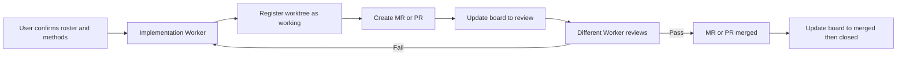

# Mode: Multi-Worker Fix/Feature with MR

Use this mode with the generic `tmux-agent-teams` protocol when several Workers
own independent fixes or features in isolated Git worktrees and deliver them
through merge requests or pull requests.

This mode adds only scenario-specific planning fields and lifecycle gates. It
does not replace the generic Leader/Worker permissions, task contracts,
artifact/receipt channels, pane registration, or worktree-board rules.

## Team Plan

| Worker     | Fix/Feature | Worktree          | Branch     | MR  | Reviewer             | Status    |
| ---------- | ----------- | ----------------- | ---------- | --- | -------------------- | --------- |
| `<worker>` | `<scope>`   | `<absolute-path>` | `<branch>` | `-` | `<different-worker>` | `working` |

Add one row for every implementation Worker. Each Worker owns exactly one
active worktree row and may update only its own MR and status metadata.

## Required Contract Additions

Every implementation task contract must name:

- Whether the change is a `fix` or `feature`
- The bounded change scope and acceptance criteria
- The absolute worktree path and attached branch
- The expected MR/PR target branch
- A different Worker responsible for review or verification
- The required evidence before the worktree can move to `closed`

## Lifecycle

## Leader Gates

The Leader must:

1. Confirm the roster, per-Worker method, worktree path, branch, reviewer, and
   acceptance criteria with the user before dispatch.
2. Keep implementation Workers on disjoint change scopes.
3. Route every MR/PR to a Worker other than its author for review.
4. Treat worktree-board status as coordination metadata, never as proof that
   implementation or verification passed.
5. Report blockers and validated receipts without reading work artifacts.

## Worker Gates

Each implementation Worker must:

1. Create or enter only the worktree named in its confirmed contract.
2. Register from its own tmux pane with `worktree-register`.
3. Update its own row with an MR/PR id before entering `review`.
4. Re-enter `working` when review requests rework.
5. Enter `merged` only after the MR/PR is merged, then `closed` after the
   worktree lifecycle is finished.

## Completion Checklist

- [ ] Every fix/feature has one Worker, one worktree, and one attached branch.
- [ ] Every active row has a unique pane, directory, and repository branch.
- [ ] Every `review` or `merged` row has an MR/PR id.
- [ ] Every MR/PR was reviewed by a different Worker.
- [ ] Required receipts and independent verification are complete.
- [ ] Merged worktrees have transitioned to `closed`.
