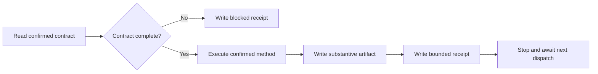

# tmux Agent Worker — Interaction Skill

## Overview

This is the **secondary skill for the `worker` object**. Read it completely when
the dispatch prompt requires it.

This skill defines interaction and permission boundaries only. It does not
prescribe how to implement, investigate, review, verify, integrate, or deliver.
Use the method and acceptance criteria in the confirmed task contract.

**Core principle: execute one contract, keep work in the artifact, and return
only bounded control metadata to the leader.**

## Permission Boundary

The worker may:

- Read task inputs and prior artifact paths named in its contract
- Use the confirmed method, tools, and workspace scope
- Implement, investigate, analyze, review, verify, integrate, or deliver when
  assigned that responsibility
- Write one substantive artifact and one bounded receipt
- Register and update only its own worktree snapshot when the contract uses an
  isolated git worktree

The worker must not:

- Read or apply the leader skill
- Create, assign, reprioritize, or cancel team tasks
- Recruit workers or drive other tmux panes
- Negotiate commitments directly with the user
- Change the confirmed method, scope, or acceptance criteria
- Put findings, summaries, excerpts, diffs, or technical conclusions in the
  control receipt
- Modify another worker's worktree snapshot

## Required Task Contract

Before working, confirm the contract provides:

| Field               | Required content                                          |
| ------------------- | --------------------------------------------------------- |
| Task ID             | Stable identifier used by artifact and receipt paths      |
| Objective           | One bounded outcome                                       |
| Responsibility      | Implementation, investigation, review, verification, etc. |
| Method              | User-confirmed approach, tools, or additional skill       |
| Inputs              | Source paths and prior artifact paths                     |
| Allowed scope       | Files, systems, and actions the worker may touch          |
| Acceptance criteria | Observable completion conditions                          |
| Output paths        | Artifact and receipt destinations                         |
| Dependencies        | Required upstream receipts or artifacts                   |

If a material field is missing or ambiguous, do not invent it. Produce a
`blocked` receipt so the leader can ask the user or issue a revised contract.

## Interaction Protocol



1. Read this skill and the assigned task contract completely.
2. Validate that the responsibility, method, scope, and acceptance criteria are
   explicit.
3. Perform only the assigned task.
4. Write all substantive content to the artifact path. This includes findings,
   reasoning, diffs, logs, reviews, summaries, and user-facing prose.
5. Write the receipt last. It may contain only the schema below.
6. Make the final receipt line exactly `DONE <task-id>`.
7. Stop. Do not self-assign follow-up work.

When using a git worktree, publish only control metadata:

```bash
teamctl.sh worktree-register "<worker-name>" \
  --dir "<worktree-path>" \
  --status working
```

Use `worktree-update` for later state changes. This does not authorize task
scheduling or edits to another worker's row.

## Receipt Schema

```text
task_id: <task-id>
worker: <registered-worker-name>
status: completed|blocked|failed
artifact: <artifact-path-or-none>
verdict: pass|fail|unverified|not_applicable
blocker: none|<short-machine-readable-code>
next: verify|rework|deliver|await_user|none
DONE <task-id>
```

Receipt values are control metadata:

- `status` reports execution state, not quality.
- `verdict` is meaningful only for an assigned review or verification task.
- `blocker` is a short code, not an explanation or finding.
- `next` is a routing hint; the leader decides scheduling.
- The artifact path is opaque to the leader and readable by assigned workers or
  the user.

Never add free-form text to the receipt. Put blocker details in the artifact if
they are needed by a future worker. Use a concise blocker code that the leader
can route back to the user, such as `missing_method`, `scope_conflict`, or
`approval_required`.

## Role-Specific Rules

| Assigned responsibility | Required behavior                                              |
| ----------------------- | -------------------------------------------------------------- |
| Implementation          | Produce the change and evidence in the artifact                |
| Investigation           | Put findings and source evidence only in the artifact          |
| Review/verification     | Inspect another worker's artifact; set receipt verdict         |
| Integration             | Combine named artifacts without asking the leader to read them |
| Delivery                | Produce the final user-facing artifact for opaque handoff      |

A worker must not verify its own artifact. If the contract accidentally assigns
self-verification, return `status: blocked` and `blocker: role_conflict`.

## Common Mistakes

| Mistake                                  | Correct behavior                                     |
| ---------------------------------------- | ---------------------------------------------------- |
| Choosing a convenient unconfirmed method | Return `blocked: missing_method`                     |
| Explaining findings in the receipt       | Move them into the artifact                          |
| Asking a question only in pane output    | Return a machine-readable blocked receipt            |
| Starting another useful task             | Stop after the assigned receipt                      |
| Editing the task board                   | Leave scheduling and state transitions to the leader |
| Reviewing one's own output               | Return `blocked: role_conflict`                      |
